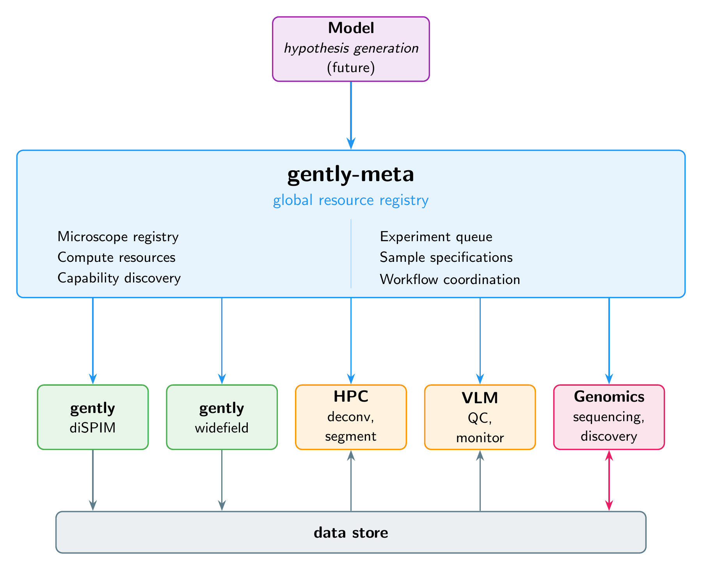

# gently-meta: Global Registry for Microscopy Resources

Infrastructure for coordinating multiple [gently](https://github.com/pskeshu/gently) systems.

A single [gently](https://github.com/pskeshu/gently) instance makes one microscope intelligent. But science doesn't happen on one instrument. A discovery on a sequencer should be able to mobilize microscopes. An imaging result should be able to trigger computation. The bottleneck in modern science isn't the instruments — it's the coordination between them.

The Human Genome Project understood this. It didn't just coordinate sequencing centers — it connected sequencing to annotation to analysis to biology. The breakthrough was coordination across modalities, not within one. No single lab could have done it alone.

Scientific instrumentation today is where sequencing was before the HGP. Experiments are facility-specific, hard to reproduce, limited by single-instrument thinking. What if every intelligent instrument in the world could discover every other?

That's what gently-meta is: a global registry where autonomous instrument agents find each other, share capabilities, and coordinate across modalities.

Imagine:
- A genomics facility in Cambridge discovers an unexpected gene expression pattern
- gently-meta mobilizes microscopes in Boston, Tokyo, and Heidelberg to validate it across diverse samples and imaging modalities
- Results flow to shared storage, processed by HPC in Frankfurt
- A VLM monitors imaging quality in real-time
- The Model project integrates genomic and imaging data to generate the next hypothesis
- Another facility picks up the follow-up experiment — in a different modality entirely

The discovery-to-validation loop that currently takes months of emails and facility bookings happens in hours. No single lab needs to own every capability. The collective sees more than any individual.

Individual gently instances remain **autonomous** — gently-meta is a registry they query, not a command layer.

## Architecture



### How it works

1. **Resources register** their capabilities with gently-meta on startup — microscopes, HPC, VLMs, genomics facilities
2. **Researchers submit experiments** to gently-meta's queue
3. **Reviewers approve** and gently-meta matches requests to capable resources across modalities
4. **Resources query** gently-meta to discover each other — a microscope finds HPC for deconvolution, a genomics facility finds microscopes for validation
5. **Results flow** to shared data store, accessible to all registered resources
6. **Discoveries in one modality trigger experiments in another** — closing the loop between observation and hypothesis

## Components

### Resource Types

| Type | Description | Examples |
|------|-------------|----------|
| `microscope` | Imaging instruments | DiSPIM, confocal, widefield |
| `compute` | Processing clusters | Slurm HPC, GPU nodes |
| `vlm` | Vision-language models | Local LLaVA, Ollama instance |
| `storage` | Data repositories | NAS, object storage |
| `analysis` | Analysis services | Segmentation, tracking |
| `genomics` | Sequencing and omics | Sequencing facilities, proteomics |
| `robotics` | Sample handling | Liquid handlers, plate movers |

### Phase 1: Infrastructure (Current)

- **Resource Registry** (`gently_meta/microscope_registry.py`): Register and discover any resource type
- **Experiment Queue** (`gently_meta/queue.py`): Priority-based queue with approval workflow
- **Sample Specification** (`schemas/sample_spec.json`): Complete experimental context schema
- **Coordination API** (`gently_meta/api.py`): REST endpoints for resource discovery and experiment management
- **Notification Service** (`gently_meta/notifications.py`): Email-based workflow coordination

### Phase 2: Intelligence (Future)

- Active learning loop integration (Model project)
- Hypothesis generation from experimental results
- Automated experiment routing based on scientific goals
- Multi-resource experiment orchestration

## Key Concepts

### Sample Specification (Sample_Spec)

The Sample_Spec defines the complete experimental context required to produce reproducible biological observations. It serves as:

- **Model Input**: Describes conditions that produced experimental data
- **Model Output**: Specifies conditions for the next experiment
- **Communication Protocol**: Standardized format between researchers, coordinators, and instruments

See `schemas/sample_spec.json` for the complete schema.

### Biological Context Search

Search experiments by biological properties to find samples of a specific kind:

```bash
# Find all HeLa cell experiments
curl "/api/v1/samples/search?cell_line=HeLa"

# Find live-cell time-lapse experiments
curl "/api/v1/samples/search?live_cell=true&has_time_lapse=true"

# Find experiments with GFP or mCherry markers
curl "/api/v1/samples/search?fluorescent_proteins=GFP&fluorescent_proteins=mCherry"

# Complex query via POST
curl -X POST /api/v1/samples/search -H "Content-Type: application/json" -d '{
  "organism": "human",
  "antibody_targets": ["tubulin", "actin"],
  "microscope_type": "confocal"
}'
```

**Searchable fields:**

| Category | Fields |
|----------|--------|
| Biology | `cell_line`, `organism`, `tissue_type` |
| Genetic | `genetic_modifications`, `fluorescent_proteins` |
| Staining | `antibody_targets`, `fluorophores`, `nuclear_stain` |
| Treatment | `compound_names` |
| Imaging | `microscope_type`, `has_z_stack`, `has_time_lapse`, `live_cell` |
| Workflow | `status` |

String fields use partial case-insensitive matching. List fields match if any item overlaps.

**Python API:**

```python
from gently_meta.queue import ExperimentQueue, BiologicalQuery

queue = ExperimentQueue()

# Search with kwargs
results = queue.find_by_biology(cell_line="HeLa", has_time_lapse=True)

# Search with query object
query = BiologicalQuery(
    organism="human",
    fluorescent_proteins=["GFP"],
    live_cell=True
)
results = queue.find_by_biology(query)

# Get summary for a specific sample
summary = queue.get_sample_summary(request_id)
```

### Experiment Request Lifecycle

```
SUBMITTED ────► UNDER_REVIEW ────► APPROVED ────► SCHEDULED ────► IN_PROGRESS ────► COMPLETED
                     │
                     └────────────► REJECTED
                     │
                     └────────────► REVISION_REQUESTED
```

### Microscope Capability Advertisement

Each gently instance advertises its capabilities:

```json
{
  "microscope_id": "dispim-001",
  "type": "light_sheet",
  "capabilities": ["3d_imaging", "live_cell", "fast_acquisition"],
  "channels": [405, 488, 561, 640],
  "objectives": [10, 20, 40, 63],
  "special_modes": ["TIRF", "FRAP"]
}
```

gently-meta matches experiment requirements to available instruments.

## Quick Start

### Installation

```bash
pip install -e .
```

### Run the API Server

```bash
python -m gently_meta.api
```

### Submit an Experiment

```python
import requests

response = requests.post('http://localhost:5000/api/v1/experiments', json={
    "sample_spec": {
        "sample_id": "hela_timelapse_001",
        "biological_context": {
            "cell_line": "HeLa",
            "passage_number": 12
        },
        "imaging_parameters": {
            "microscope_type": "widefield",
            "channels": [{"name": "DAPI", "excitation": 405}],
            "time_lapse": {"enabled": True, "interval": 300}
        }
    },
    "requester": {
        "name": "Dr. Jane Smith",
        "email": "jsmith@university.edu",
        "institution": "University of Biology"
    },
    "experiment": {
        "microscope_system": "DiSPIM",
        "scientific_rationale": "Study cell division dynamics...",
        "priority": "high"
    }
})

print(f"Request ID: {response.json()['request_id']}")
```

## API Endpoints

### Experiment Management

| Method | Endpoint | Description |
|--------|----------|-------------|
| POST | `/api/v1/experiments` | Submit new experiment |
| GET | `/api/v1/experiments` | List experiments (with filters) |
| GET | `/api/v1/experiments/{id}` | Get experiment details |
| PUT | `/api/v1/experiments/{id}/status` | Update experiment status |

### Review Workflow

| Method | Endpoint | Description |
|--------|----------|-------------|
| GET | `/api/v1/review/pending` | Get pending reviews |
| POST | `/api/v1/review/{id}/approve` | Approve experiment |
| POST | `/api/v1/review/{id}/reject` | Reject experiment |

### Resource Registry

| Method | Endpoint | Description |
|--------|----------|-------------|
| GET | `/api/v1/microscopes` | List available resources |
| POST | `/api/v1/microscopes/register` | Register new resource |
| PUT | `/api/v1/microscopes/{id}/status` | Update resource status |
| GET | `/api/v1/microscopes/find` | Find resources by capability |

### Sample Search

| Method | Endpoint | Description |
|--------|----------|-------------|
| GET/POST | `/api/v1/samples/search` | Search by biological context |
| GET | `/api/v1/samples/{id}/summary` | Get sample summary |

### Statistics

| Method | Endpoint | Description |
|--------|----------|-------------|
| GET | `/api/v1/stats` | Queue statistics |
| GET | `/api/v1/health` | Health check |

## Configuration

### Environment Variables

```bash
export QUEUE_STORAGE_PATH=/path/to/queue.json
export MICROSCOPE_REGISTRY_PATH=/path/to/microscopes.json
export SMTP_SERVER=smtp.gmail.com
export SMTP_PORT=587
export SMTP_USER=your_email@gmail.com
export SMTP_PASSWORD=your_app_password
export FROM_EMAIL=experiments@lab.org
export PORT=5000
```

### Notification Configuration

Edit `notification_config.json` to configure reviewers for each microscope system:

```json
{
  "enabled": true,
  "reviewers": {
    "DiSPIM": ["ryan@lab.org"],
    "confocal": ["imaging-team@lab.org"]
  }
}
```

## Integration with Model

gently-meta provides the **registry and coordination layer**; Model provides the **intelligence**:

| gently-meta (Registry) | Model (Intelligence) |
|------------------------|---------------------|
| Resource discovery | Active learning loop |
| Experiment queue | Hypothesis generation |
| Capability matching | Experiment design |
| Sample specifications | Representation updating |

Model queries gently-meta to find resources, then directs experiments based on scientific goals.

```python
# Find available deconvolution service
hpc = gently_meta.find(capability="deconvolution", status="online")

# Find VLM for quality control
vlm = gently_meta.find(type="vlm", capability="image_qc")
```

## Development

### Project Structure

```
gently-meta/
├── README.md
├── LICENSE
├── pyproject.toml
├── schemas/
│   ├── sample_spec.json          # Sample specification JSON schema
│   ├── experiment_request.json   # Experiment request schema
│   └── microscope_capability.json # Microscope capability schema
├── gently_meta/
│   ├── __init__.py
│   ├── queue.py                  # Experiment queue management
│   ├── api.py                    # REST API server
│   ├── notifications.py          # Notification service
│   └── microscope_registry.py    # Resource registry
└── tests/
    └── test_queue.py
```

### Running Tests

```bash
pytest tests/
```

## Open Questions

- Federation across institutions?
- Authentication and authorization model?
- Data sovereignty and privacy constraints?
- Handling network partitions and offline operation?

## Contributing

Ideas and contributions welcome. See issues for current discussions.

## License

See [LICENSE](LICENSE) file.
